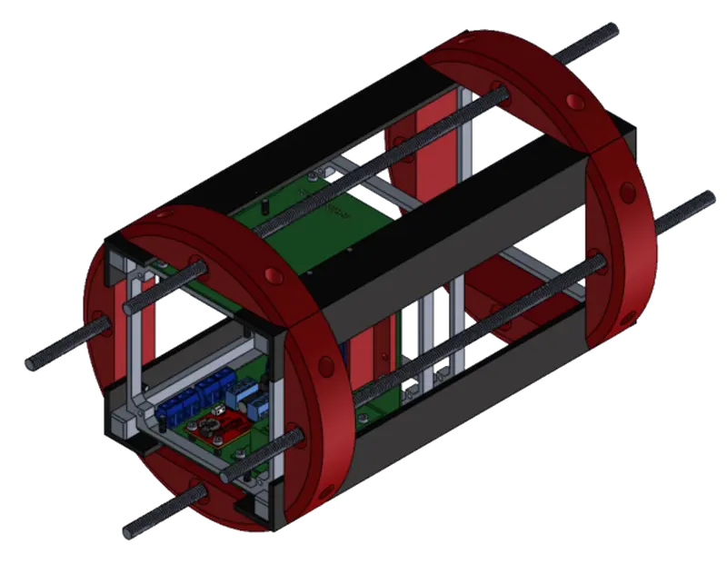
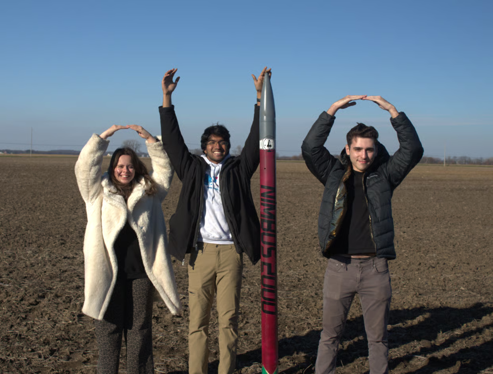

# Adam Sabet

**M.S. Electrical Engineering @ Stanford — Robotics & Control**

Physics & Economics B.S. from Ohio State. I'm interested in robotics that adapt to real environments and do something genuinely useful for people — assistive robotics, healthcare, and autonomy that leaves the lab.

[LinkedIn](https://www.linkedin.com/in/adamsabet1/) · odyssey@stanford.edu

---

## NASA Student Launch Initiative — Avionics Bay

*Buckeye Space Launch Initiative, The Ohio State University · Aug 2023 – May 2026*

  
  

I designed and prototyped this avionics bay in CAD, incorporating feedback from mentors and alumni to optimize component layout and structural integrity. I machined its components on mills, lathes, and belt sanders to meet flight-readiness tolerances, and worked across subsystems to integrate the bay with our payload and recovery systems.

As Deputy Project Manager, I later led systems integration and testing across the full vehicle — coordinating avionics, recovery, and structures sub-teams, directing full-vehicle testing and hardware verification, and defending our engineering and safety decisions directly to NASA engineers in formal design reviews. Our team consistently ranked in the top 20 of 80+ universities nationally.

**Skills:** CAD (SolidWorks, Onshape) · CNC machining · PCB layout (Altium) · wiring & circuit diagrams · systems integration · hardware verification & validation

🔗 [bsli.space](https://www.bsli.space/)

---

## 3-DOF Robotic Arm — Independent Learning Project

*Jun 2026 – Present*

An ongoing project to build hands-on fluency in robotic manipulation ahead of my M.S. I worked through the forward and inverse kinematics from first principles before implementing anything, then used AI-assisted coding to implement and iterate on a working prototype in simulation — a deliberate choice to move faster on implementation while staying responsible for understanding and verifying the underlying math myself.

Next steps: extending to physical hardware, and relying less on AI assistance as my independent implementation skills solidify.

**Skills:** forward/inverse kinematics · Python · embedded control · simulation

---

## Currently

- Building depth in controls, embedded systems, and robot learning
- Coursework: robotic autonomy, machine learning, decision making under uncertainty, state estimation
- Open to research and internship collaborations in robotics, autonomy, and embedded systems
